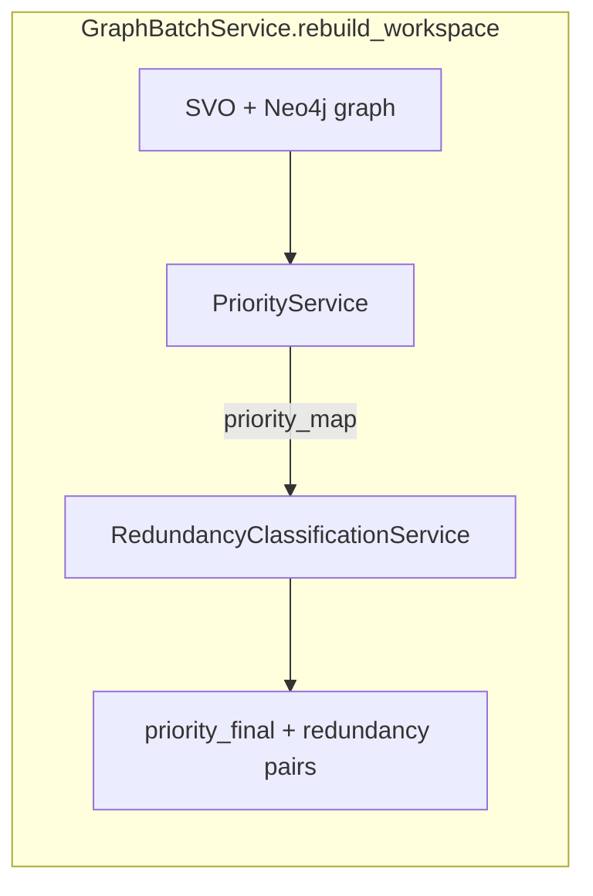
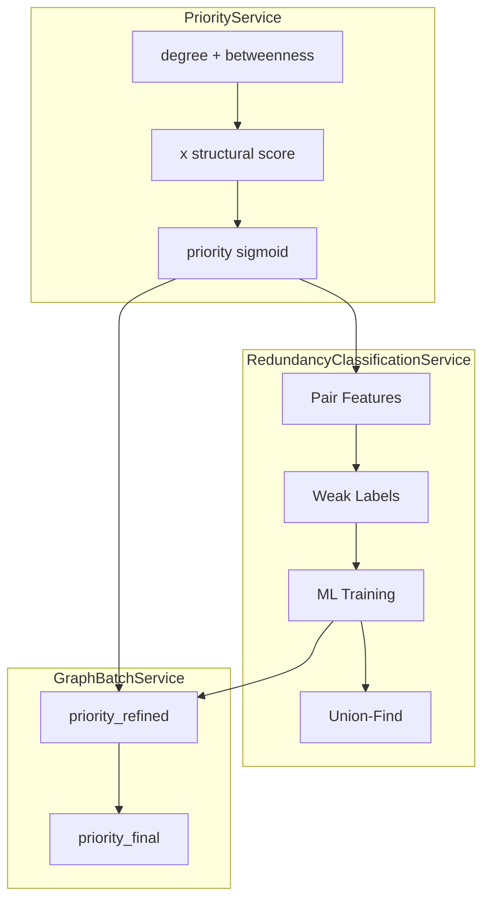
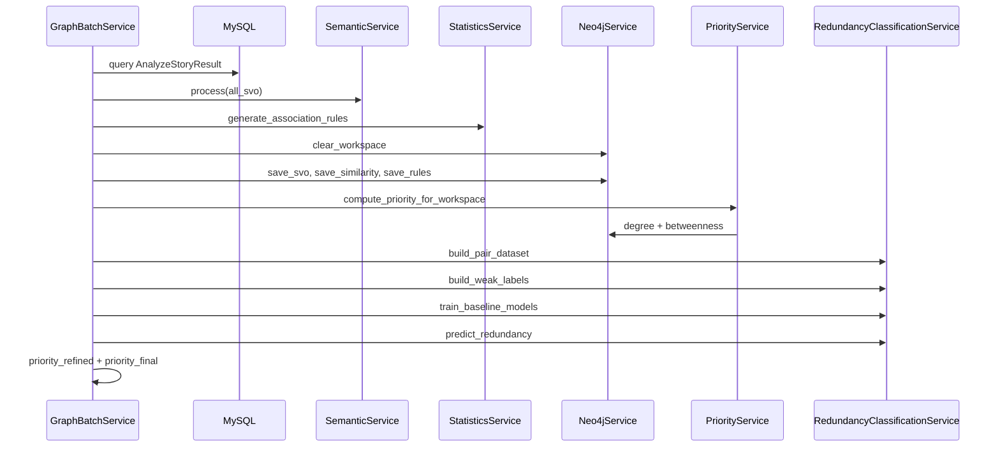

# Phân tích `priority_service.py` và `redundancy_classification_service.py`

**File nguồn:**

- `src/services/priority_service.py`
- `src/services/redundancy_classification_service.py`
- Orchestration: `src/services/graph_batch_service.py`

---

# Mục lục

1. Bối cảnh pipeline
2. PriorityService — công thức và code
3. RedundancyClassificationService — công thức và code
4. Tích hợp GraphBatchService
5. Bảng tổng hợp công thức
6. Ví dụ số minh họa
7. Sequence: `rebuild_workspace`
8. Lưu ý vận hành

---

# 1. Bối cảnh pipeline



| Service | Đầu ra chính | Vai trò |
|---|---|---|
| **PriorityService** | `UserStory.priority ∈ (0,1)` | Độ ưu tiên cấu trúc từ centrality object trên đồ thị Term |
| **RedundancyClassificationService** | `redundancy_prob`, `is_redundant`, `group_*` | Phân loại cặp story trùng lặp |
| **GraphBatchService** | `priority_refined`, `priority_final` | Trộn priority với similarity/rule và giảm theo redundancy |

---

# 2. PriorityService — công thức và code

## 2.1 Vai trò class

`PriorityService` nhận `neo4j_service` và `db`.

Nhiệm vụ chính:

- Tính centrality cho `Term`
- Mapping story → objects
- Sinh priority cấu trúc cho `UserStory`

Entry point:

```python
compute_priority_for_workspace(workspace_id)
```

---

## 2.2 Degree trên Term

### Cypher

```cypher
MATCH (n:Term {workspace_id: $ws})
OPTIONAL MATCH (n)--(m:Term {workspace_id: $ws})
WITH n, count(m) AS deg
SET n.degree = deg
```

### Công thức

<p align="center">
  
</p>

### Ý nghĩa

- Degree càng cao → object càng phổ biến trong graph.
- Term kết nối nhiều node khác → ảnh hưởng domain lớn hơn.

---

## 2.3 Betweenness Centrality

### Pipeline

1. Drop graph projection cũ
2. Project `Term → Term`
3. Chạy `gds.betweenness.write`
4. Normalize min-max
5. Drop graph projection

### Chuẩn hóa

<p align="center">
  
</p>

### Ý nghĩa

- Term nằm trên nhiều shortest path → đóng vai trò bridge.
- Giá trị sau normalize nằm trong `[0,1]`.

---

## 2.4 Fallback khi GDS lỗi

```cypher
SET n.betweenness = coalesce(n.degree, 0) * 1.0
```

### Công thức

<p align="center">
  
</p>

### Lưu ý

Fallback không normalize.

Điều này làm scale khác với nhánh GDS thật.

---

## 2.5 Object theo story

### Mô hình graph

```text
Subject -[PERFORM {story_id}]-> Action -[TARGET]-> Object
```

### Cypher

```cypher
MATCH (sub:Term {workspace_id: $ws})-[r:PERFORM]->(act:Term)
WHERE r.story_id IS NOT NULL
MATCH (act)-[:TARGET]->(obj:Term)
RETURN r.story_id AS story_id, collect(DISTINCT obj.name) AS objects
```

---

## 2.6 Điểm cấu trúc story

### Degree trung bình

<p align="center">
  
</p>

### Betweenness trung bình

<p align="center">
  
</p>

### Structural score

<p align="center">
  
</p>

### Code tương ứng

```python
degree_avg = degree_sum / len(objects)
between_avg = between_sum / len(objects)
x = 0.5 * degree_avg + 0.5 * between_avg
```

---

## 2.7 Robust scaling

### Median + IQR

<p align="center">
  
</p>

### Khi IQR > 0

<p align="center">
  
</p>

### Transform trước sigmoid

<p align="center">
  
</p>

---

## 2.8 Sigmoid — priority cuối

<p align="center">
  
</p>

### Code

```python
def sigmoid(self, x):
    return 1 / (1 + math.exp(-x))
```

---

# 3. RedundancyClassificationService — công thức và code

## 3.1 Vai trò class

Service này:

1. Sinh feature cho từng cặp story
2. Weak labeling
3. Train baseline ML
4. Predict redundancy probability
5. Gom nhóm bằng Union-Find

---

## 3.2 Pair features

| Feature | Ý nghĩa |
|---|---|
| `same_subject` | Subject giống nhau |
| `same_action` | Action giống nhau |
| `same_object` | Object giống nhau |
| `object_similarity` | Similarity giữa object |
| `action_similarity` | Similarity giữa action |
| `rule_confidence` | Confidence association rule |
| `rule_lift` | Lift association rule |
| `priority_gap` | Chênh lệch priority |

### Priority gap

<p align="center">
  
</p>

---

## 3.3 Weak labeling

### Positive label

<p align="center">
  
</p>

### Negative label

<p align="center">
  
</p>

---

## 3.4 Baseline models

| Model | Ghi chú |
|---|---|
| Logistic Regression | Có StandardScaler |
| Random Forest | Balanced subsample |
| HistGradientBoosting | Gradient boosting histogram |

### Chọn model tốt nhất

<p align="center">
  
</p>

---

## 3.5 Predict redundancy

### Fallback score

<p align="center">
  
</p>

### Probability

<p align="center">
  
</p>

### Decision rule

<p align="center">
  
</p>

---

## 3.6 Union-Find grouping

- Mỗi story ban đầu là root riêng.
- Nếu redundant → union.
- Các story connected gián tiếp sẽ cùng group.

Ví dụ:

```text
A -- B
B -- C
=> group(A) = group(B) = group(C)
```

---

## 3.7 Aggregate redundancy score

<p align="center">
  
</p>

---

# 4. Tích hợp GraphBatchService

## 4.1 Priority refined

<p align="center">
  
</p>

---

## 4.2 Priority final

<p align="center">
  
</p>

---

## 4.3 Pipeline tổng quát



---

# 5. Ví dụ số minh họa

## 5.1 Centrality

| Object | degree | betweenness |
|---|---|---|
| payment | 4 | 1.0 |
| invoice | 2 | 0.5 |
| report | 1 | 0.0 |

---

## 5.2 Structural score

| Story | Object | x_s |
|---|---|---|
| S1 | payment | 2.5 |
| S2 | invoice | 1.25 |
| S3 | report | 0.5 |

### Ví dụ

<p align="center">
  
</p>

---

## 5.3 Scaling

Giả sử:

- median = 1.25
- IQR = 1

### Hệ số

<p align="center">
  
</p>

### Priority

| Story | z | priority |
|---|---|---|
| S1 | 5 | 0.993 |
| S2 | 0 | 0.500 |
| S3 | -3 | 0.047 |

---

## 5.4 Priority final

<p align="center">
  
</p>

---

# 6. Sequence — rebuild_workspace



---

# 7. Lưu ý vận hành

| Chủ đề | Chi tiết |
|---|---|
| Complexity | Redundancy O(n²) |
| Weak labels | Có thể nhiều unlabeled pairs |
| GDS fallback | Scale khác branch GDS |
| Export graph | Chỉ top-K redundancy pairs |
| Priority gap | Feature ML quan trọng |

---

# 8. Kết luận

Pipeline hiện tại kết hợp:

- Graph centrality
- Semantic similarity
- Association rules
- Weak supervision
- Machine learning
- Redundancy-aware prioritization

để sinh:

- `priority_initial`
- `priority_refined`
- `priority_final`
- `redundancy_prob`
- `redundancy_groups`

trên toàn bộ workspace user story.

