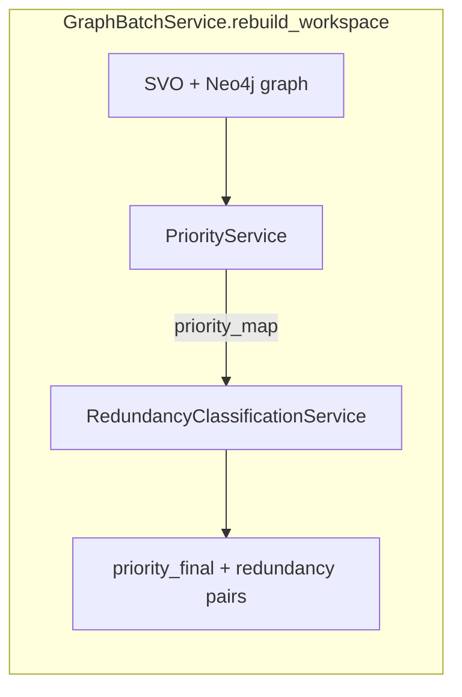
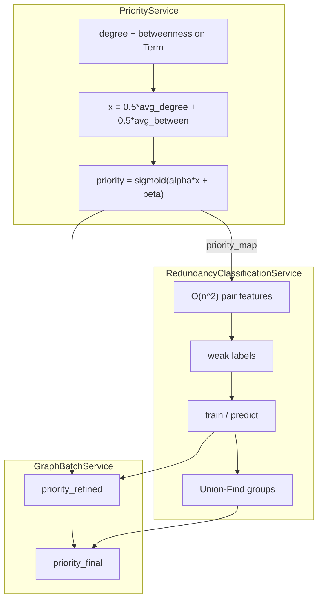
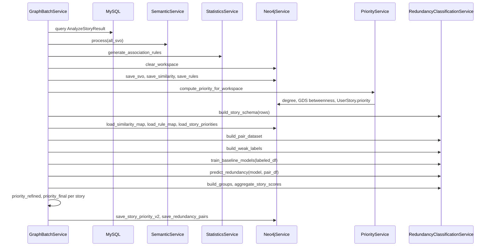

# Phân tích `priority_service.py` và `redundancy_classification_service.py`

**File nguồn:**

- [`src/services/priority_service.py`](../src/services/priority_service.py)
- [`src/services/redundancy_classification_service.py`](../src/services/redundancy_classification_service.py)
- Orchestration: [`src/services/graph_batch_service.py`](../src/services/graph_batch_service.py)

---

## Mục lục

1. [Bối cảnh pipeline](#1-bối-cảnh-pipeline)
2. [PriorityService — công thức và code](#2-priorityservice--công-thức-và-code)
3. [RedundancyClassificationService — công thức và code](#3-redundancyclassificationservice--công-thức-và-code)
4. [Tích hợp GraphBatchService](#4-tích-hợp-graphbatchservice)
5. [Bảng tổng hợp công thức](#5-bảng-tổng-hợp-công-thức)
6. [Ví dụ số minh họa](#6-ví-dụ-số-minh-họa)
7. [Sequence: `rebuild_workspace`](#7-sequence-rebuild_workspace)
8. [Lưu ý vận hành](#8-lưu-ý-vận-hành)

---

## 1. Bối cảnh pipeline



| Service | Đầu ra chính | Vai trò |
|---------|--------------|---------|
| **PriorityService** | `UserStory.priority` ∈ (0, 1) | Độ ưu tiên **cấu trúc** từ centrality object trên đồ thị Term |
| **RedundancyClassificationService** | `redundancy_prob`, `is_redundant`, `group_*` | Phân loại **cặp** story trùng lặp (ML + weak labels) |
| **GraphBatchService** (bổ sung) | `priority_refined`, `priority_final` | Trộn priority với similarity/rule và giảm theo redundancy |

---

## 2. PriorityService — công thức và code

### 2.1 Vai trò class

`PriorityService` nhận `neo4j_service` và `db` (tham số `db` hiện **không được dùng** trong file). Nhiệm vụ: với mỗi workspace, gán điểm ưu tiên cho node `UserStory` dựa trên mức “trung tâm” của các **object** (Term) mà story nhắm tới.

Entry point: `compute_priority_for_workspace(workspace_id)`.

### 2.2 Luồng method

| Bước | Method | Mô tả |
|------|--------|--------|
| 1 | `compute_centrality` | Gán `degree`, `betweenness` cho mọi `Term` |
| 2 | `load_story_objects` | `story_id` → danh sách tên object |
| 3 | `load_all_object_scores` | Cache `(degree, betweenness)` theo `(workspace_id, name)` |
| 4 | Vòng lặp | Tính điểm cấu trúc `x_s` mỗi story |
| 5 | `compute_scaling` | `alpha`, `beta` từ phân phối các `x_s` |
| 6 | `sigmoid` + `update_priority` | Lưu `UserStory.priority` |

### 2.3 Degree trên Term

**Cypher** (quan hệ không hướng giữa các Term cùng workspace):

```cypher
MATCH (n:Term {workspace_id: $ws})
OPTIONAL MATCH (n)--(m:Term {workspace_id: $ws})
WITH n, count(m) AS deg
SET n.degree = deg
```

**Công thức:**

\[
\text{degree}(n) = \bigl|\{ m : (n)\text{--}(m),\; m \in \text{Term},\; \text{cùng } workspace\_id \}\bigr|
\]

**Ý nghĩa:** Term càng nối nhiều Term khác trong domain → bậc cao → object “phổ biến” trong graph.

### 2.4 Betweenness (Neo4j GDS)

**Các bước:**

1. `gds.graph.drop('termGraph')` (bỏ qua lỗi nếu chưa tồn tại).
2. `gds.graph.project.cypher` — subgraph chỉ `Term` và cạnh directed `Term→Term` trong workspace.
3. `gds.betweenness.write` → property `betweenness`.
4. **Chuẩn hóa min-max** trong workspace:

\[
\text{betweenness}_{norm}(m) =
\begin{cases}
\dfrac{B(m)}{\max_{n \in WS} B(n)} & \text{nếu } \max B > 0 \\
0 & \text{ngược lại}
\end{cases}
\]

5. Drop graph `termGraph`.

**Ý nghĩa:** Term nằm trên nhiều đường đi ngắn nhất giữa các cặp Term khác → “cầu nối” domain → betweenness cao (sau chuẩn hóa ∈ [0, 1]).

### 2.5 Fallback khi GDS lỗi

```cypher
SET n.betweenness = coalesce(n.degree, 0) * 1.0
```

\[
\text{betweenness}(n) := \text{degree}(n)
\]

**Khác biệt quan trọng:** Nhánh fallback **không** chuẩn hóa về [0, 1]. `degree` có thể > 1 → `x_s` và sigmoid có thể lệch so với nhánh GDS.

### 2.6 Object theo story

```cypher
MATCH (sub:Term {workspace_id: $ws})-[r:PERFORM]->(act:Term)
WHERE r.story_id IS NOT NULL
MATCH (act)-[:TARGET]->(obj:Term)
RETURN r.story_id AS story_id, collect(DISTINCT obj.name) AS objects
```

**Mô hình đồ thị:**

```text
Subject -[PERFORM {story_id}]-> Action -[TARGET]-> Object
```

Mỗi story `s` có tập object \(O_s\) (có thể nhiều object nếu nhiều nhánh TARGET).

### 2.7 Điểm cấu trúc story \(x_s\)

Với cache `object_cache[(workspace_id, obj)] = (degree, betweenness)`:

\[
\bar{d}_s = \frac{1}{|O_s|} \sum_{o \in O_s} \text{degree}(o)
\]

\[
\bar{b}_s = \frac{1}{|O_s|} \sum_{o \in O_s} \text{betweenness}(o)
\]

\[
x_s = 0.5 \cdot \bar{d}_s + 0.5 \cdot \bar{b}_s
\]

**Code tương ứng:**

```python
degree_avg = degree_sum / len(objects)
between_avg = between_sum / len(objects)
x = 0.5 * degree_avg + 0.5 * between_avg
```

| Trường hợp | Kết quả |
|------------|---------|
| `objects` rỗng | `x_s = 0` |
| Term không trong cache | `(degree, between) = (0, 0)` |

### 2.8 Robust scaling — `compute_scaling`

Input: `struct_scores = [(story_id, x_s), ...]`; `values = [x_s]`.

| Thống kê | Code |
|----------|------|
| Median | `np.median(values)` |
| Q1, Q3 | percentile 25, 75 |
| IQR | `q3 - q1` |

**IQR = 0** (một story, hoặc mọi `x_s` gần bằng nhau):

\[
\alpha = 1,\quad \beta = -\text{median}(values)
\]

**IQR > 0:**

\[
\alpha = \frac{4}{\text{IQR}},\quad \beta = -\alpha \cdot \text{median}(values)
\]

**Biến đổi trước sigmoid:**

\[
z_s = \alpha \cdot x_s + \beta
\]

**Thiết kế:** Căn giữa phân phối quanh median; co giãn theo IQR sao khoảng [Q1, Q3] (~50% story) chiếm khoảng **4 đơn vị** trên trục \(z\) trước khi qua logistic — tương tự robust z-score (dùng IQR thay σ).

### 2.9 Sigmoid — priority cuối

\[
\text{priority}_s = \sigma(z_s) = \frac{1}{1 + e^{-z_s}}
\]

```python
def sigmoid(self, x):
    return 1 / (1 + math.exp(-x))
```

- Kết quả ∈ **(0, 1)** (không bao giờ đúng 0 hoặc 1 với float thông thường).
- Lưu Neo4j: `MERGE (s:UserStory {id}) SET s.priority = $priority`.

### 2.10 Cache workspace-scoped

```python
cache[(workspace_id, r["name"])] = (r["degree"], r["betweenness"])
```

Tránh trộn score khi hai workspace có Term trùng tên.

---

## 3. RedundancyClassificationService — công thức và code

### 3.1 Vai trò class

Phân loại **cặp** user story có redundant hay không:

1. Feature engineering từ SVO + similarity + association rules + priority.
2. **Weak labels** (heuristic, không phải ground truth).
3. Train 3 baseline models, chọn theo F1 class redundant.
4. Dự đoán xác suất, ngưỡng `threshold` (mặc định **0.6**, env `REDUNDANCY_THRESHOLD`).
5. Union-Find nhóm story; aggregate max prob theo story.

### 3.2 `StoryFeature` và `build_story_schema`

Dataclass:

```python
@dataclass
class StoryFeature:
    story_id: str
    subject: str
    action: str
    object_name: str
```

**Xử lý row DB (`AnalyzeStoryResult`):**

- Bỏ row không có `asr_user_story_id`.
- Chuẩn hóa: `canonical or raw`, `.strip().lower()`.
- Bỏ nếu thiếu bất kỳ thành phần SVO.
- **Dedup** theo `story_id` (bản ghi sau ghi đè bản trước).

### 3.3 Ma trận cặp — `build_pair_dataset`

- Sinh cặp: `combinations(stories, 2)` → **C(n, 2)** cặp, độ phức tạp **O(n²)**.
- Khóa đối xứng: `sorted_term_pair(a, b)` → `(min, max)` sau lower+strip.

| Feature | Công thức / nguồn |
|---------|-------------------|
| `same_subject` | 1.0 nếu `left.subject == right.subject`, else 0.0 |
| `same_action` | tương tự `action` |
| `same_object` | tương tự `object_name` |
| `object_similarity` | `similarity_map[sorted_pair(obj_L, obj_R)]`, default 0 |
| `action_similarity` | `similarity_map[sorted_pair(act_L, act_R)]`, default 0 |
| `rule_confidence` | `max(conf_obj_pair, conf_act_pair)` |
| `rule_lift` | `max(lift_obj_pair, lift_act_pair)` |
| `priority_gap` | `\|priority(left) - priority(right)\|` từ PriorityService |

`rule_map` và `similarity_map` được build trong `GraphBatchService` từ Neo4j (max score khi trùng key).

### 3.4 Weak labeling — `build_weak_labels`

Khởi tạo: `weak_label = -1` (unlabeled).

**Positive (weak_label = 1):**

\[
\begin{aligned}
&\big(\text{object\_sim} \ge 0.75 \;\lor\; (\text{same\_object}=1 \land \text{action\_sim} \ge 0.5)\big) \\
&\land\; \text{rule\_confidence} \ge 0.5 \\
&\land\; \text{rule\_lift} \ge 1.0
\end{aligned}
\]

**Negative (weak_label = 0):**

\[
\text{object\_sim} \le 0.25 \land \text{action\_sim} \le 0.25 \land \text{same\_object}=0 \land \text{rule\_confidence} \le 0.3
\]

**Train:** chỉ `weak_label >= 0` (`labeled_df`). Cặp `-1` vẫn được **predict** sau train.

| Ngưỡng | Giá trị | Ghi chú |
|--------|---------|---------|
| object_sim (pos) | ≥ 0.75 | Cố định trong code |
| action_sim (pos, khi same_object) | ≥ 0.5 | |
| rule_confidence (pos) | ≥ 0.5 | |
| rule_lift (pos) | ≥ 1.0 | Lift > 1: rule mạnh hơn ngẫu nhiên |
| object/action_sim (neg) | ≤ 0.25 | |
| rule_confidence (neg) | ≤ 0.3 | |

### 3.5 Huấn luyện — `train_baseline_models`

**Feature columns (8):** `same_subject`, `same_action`, `same_object`, `action_similarity`, `object_similarity`, `rule_confidence`, `rule_lift`, `priority_gap`.

**Dừng sớm:**

| Điều kiện | Return |
|-----------|--------|
| `labeled_df` rỗng | `None`, `reason: no_labeled_pairs` |
| `weak_label.nunique() < 2` | `None`, `reason: single_class_labels` |

**Split:** `train_test_split(..., test_size=0.3, random_state=42, stratify=y)`.

**Models:**

| Tên | Cấu hình |
|-----|----------|
| `logistic_regression` | `StandardScaler` + `LogisticRegression(max_iter=200, class_weight="balanced")` |
| `random_forest` | `n_estimators=250`, `class_weight="balanced_subsample"` |
| `hist_gradient_boosting` | `HistGradientBoostingClassifier` (không scale) |

**Chọn best:** `max` theo `f1_score(y_test, pred, pos_label=1)`.

**Xác suất trên test (để metric):**

- Có `predict_proba` → `[:, 1]`.
- Không có → `1 / (1 + exp(-decision_function(x)))`.

**Metrics lưu:** `f1_redundant`, `recall_redundant`, `pr_auc` (`average_precision_score`).

### 3.6 Dự đoán — `predict_redundancy`

**Fallback khi `model is None`:**

\[
\text{score} = 0.35 \cdot s_{obj} + 0.2 \cdot s_{act} + 0.15 \cdot \mathbb{1}_{same\_obj} + 0.15 \cdot c_{rule} + 0.15 \cdot \mathbb{1}_{same\_act}
\]

`redundancy_prob = clip(score, 0, 1)`.

**Có model:**

\[
\text{redundancy\_prob} = P(y=1 \mid \mathbf{x})
\]

**Quyết định:**

\[
\text{is\_redundant} = (\text{redundancy\_prob} \ge \text{threshold})
\]

### 3.7 Nhóm redundant — `build_groups`

**Union-Find** với path compression:

- Khởi tạo: mỗi `story_id` là root riêng.
- Với mỗi cặp `is_redundant == True`: `union(left, right)`.
- Gán `group_1`, `group_2`, ... theo thứ tự duyệt `stories` (root mới → index tăng).

Hai story redundant **gián tiếp** (A–B, B–C) cùng một component → cùng `group_id`.

### 3.8 Điểm story — `aggregate_story_scores`

\[
\text{redundancy\_score}(s) = \max_{t \neq s} \text{redundancy\_prob}(s, t)
\]

Khởi tạo 0.0; duyệt mọi hàng `pair_df`, cập nhật max cho `left_story_id` và `right_story_id`.

---

## 4. Tích hợp GraphBatchService

Sau khi hai service chạy, [`graph_batch_service.py`](../src/services/graph_batch_service.py) tính thêm **priority tinh chỉnh** và **priority cuối** (không nằm trong hai file service trên).

### 4.1 Thứ tự trong `rebuild_workspace`

1. Load SVO từ MySQL → semantic → association rules.
2. Clear + save Neo4j (SVO, similarity, rules).
3. **`priority_service.compute_priority_for_workspace`**
4. `build_story_schema` → maps similarity, rule, **priority_map**
5. `build_pair_dataset` → `build_weak_labels` → `train_baseline_models` → `predict_redundancy`
6. `build_groups`, `aggregate_story_scores`
7. Export top-K cặp redundant → Neo4j; `save_story_priority_v2` với `priority_refined`, `priority_final`.

### 4.2 Tín hiệu similarity / rule (theo story)

Với mỗi story, so với **mọi** story khác trong workspace:

\[
s_{obj} = \max_{t} \text{sim}(\text{object}_s, \text{object}_t)
\]

\[
s_{act} = \max_{t} \text{sim}(\text{action}_s, \text{action}_t)
\]

\[
s_{sim} = 0.5 \cdot s_{obj} + 0.5 \cdot s_{act}
\]

\[
s_{rule} = \max_{t} \text{confidence}_{rule}(\text{object}_s, \text{object}_t)
\]

### 4.3 Priority refined và final

\[
\text{priority\_refined} = w_0 \cdot p_{\text{initial}} + w_1 \cdot s_{sim} + w_2 \cdot s_{rule}
\]

\[
\text{priority\_final} = \text{priority\_refined} \cdot (1 - \alpha_r \cdot \text{redundancy\_prob})
\]

Clip cả hai về **[0, 1]** trước khi lưu.

**Hệ số mặc định** ([`constant.py`](../constant.py)):

| Biến env | Mặc định | Ý nghĩa |
|----------|----------|---------|
| `PRIORITY_W_INITIAL` | 0.5 | Trọng số priority cấu trúc (PriorityService) |
| `PRIORITY_W_SIMILARITY` | 0.3 | Trọng số similarity SVO |
| `PRIORITY_W_RULE` | 0.2 | Trọng số rule confidence |
| `PRIORITY_REDUNDANCY_ALPHA` | 0.6 | Mức giảm priority khi redundant cao |
| `REDUNDANCY_THRESHOLD` | 0.6 | Ngưỡng `is_redundant` |
| `REDUNDANCY_GRAPH_TOP_K` | 100 | Số cặp export Neo4j (top prob) |
| `REDUNDANCY_GRAPH_MIN_SCORE` | 0.0 | Lọc tối thiểu trước top-K |



---

## 5. Bảng tổng hợp công thức

### 5.1 PriorityService

| Ký hiệu | Công thức | Ghi chú |
|---------|-----------|---------|
| `degree(n)` | Số Term láng giềng cùng WS | Neo4j count |
| `betweenness_norm(m)` | `B(m) / max B` hoặc 0 | Chỉ nhánh GDS |
| `betweenness` (fallback) | `degree(n)` | Không chuẩn hóa |
| `x_s` | `0.5 * mean(degree(o)) + 0.5 * mean(between(o))` | `o ∈ O_s` |
| `α, β` | `α=4/IQR`, `β=-α·median` hoặc `α=1, β=-median` | `IQR=0` |
| `priority_s` | `1 / (1 + exp(-(α·x_s + β)))` | Sigmoid |

### 5.2 RedundancyClassificationService

| Ký hiệu | Công thức | Ghi chú |
|---------|-----------|---------|
| `priority_gap` | `\|p_L - p_R\|` | Từ PriorityService |
| `weak_label=1` | (obj≥0.75 ∨ (same_obj∧act≥0.5)) ∧ conf≥0.5 ∧ lift≥1 | Heuristic |
| `weak_label=0` | obj≤0.25 ∧ act≤0.25 ∧ ¬same_obj ∧ conf≤0.3 | Heuristic |
| `redundancy_prob` (fallback) | `0.35·obj + 0.2·act + 0.15·same_obj + 0.15·conf + 0.15·same_act` | Clip [0,1] |
| `is_redundant` | `prob ≥ threshold` | Default threshold 0.6 |
| `redundancy_score(s)` | `max_{pairs∋s} redundancy_prob` | Story-level |

### 5.3 GraphBatchService (bổ sung)

| Ký hiệu | Công thức |
|---------|-----------|
| `priority_refined` | `w0·p_initial + w1·s_sim + w2·s_rule` |
| `priority_final` | `priority_refined · (1 - α_r · redundancy_prob)` |

---

## 6. Ví dụ số minh họa

### 6.1 Giả định đồ thị Term (1 workspace)

| Term (object) | degree | betweenness (GDS, đã norm) |
|---------------|--------|----------------------------|
| `payment` | 4 | 1.0 |
| `invoice` | 2 | 0.5 |
| `report` | 1 | 0.0 |

### 6.2 Ba user story

| story_id | Objects \(O_s\) | \(\bar{d}_s\) | \(\bar{b}_s\) | \(x_s\) |
|----------|-----------------|---------------|---------------|---------|
| S1 | `{payment}` | 4 | 1.0 | **2.5** |
| S2 | `{invoice}` | 2 | 0.5 | **1.25** |
| S3 | `{report}` | 1 | 0.0 | **0.5** |

\[
x_{S1} = 0.5(4) + 0.5(1) = 2.5,\quad
x_{S2} = 0.5(2) + 0.5(0.5) = 1.25,\quad
x_{S3} = 0.5(1) + 0.5(0) = 0.5
\]

### 6.3 Scaling (giả sử IQR > 0)

Giả sử `median = 1.25`, `Q1 = 0.875`, `Q3 = 1.875` → `IQR = 1.0`:

\[
\alpha = 4/1 = 4,\quad \beta = -4 \times 1.25 = -5
\]

| Story | \(z = \alpha x + \beta\) | priority ≈ σ(z) |
|-------|--------------------------|-----------------|
| S1 | \(4×2.5 - 5 = 5\) | ≈ **0.993** |
| S2 | \(4×1.25 - 5 = 0\) | **0.500** |
| S3 | \(4×0.5 - 5 = -3\) | ≈ **0.047** |

Story trỏ object “trung tâm” (`payment`) được priority cao nhất.

### 6.4 Một cặp redundant (minh họa feature)

**S1 vs S2** (cùng domain billing, khác object):

| Feature | Giá trị giả định |
|---------|------------------|
| same_subject | 1 |
| same_action | 0 |
| same_object | 0 |
| object_similarity | 0.8 (payment–invoice) |
| action_similarity | 0.6 |
| rule_confidence | 0.7 |
| rule_lift | 1.2 |
| priority_gap | \|0.993 - 0.5\| ≈ 0.493 |

**Weak label:** object_sim ≥ 0.75, conf ≥ 0.5, lift ≥ 1.0 → **weak_label = 1** (positive).

**Fallback score** (nếu không train được model):

\[
0.35(0.8) + 0.2(0.6) + 0.15(0) + 0.15(0.7) + 0.15(0) = 0.28 + 0.12 + 0.105 = 0.505
\]

Với `threshold = 0.6` → `is_redundant = False` (fallback); model có thể đẩy prob cao hơn nếu học từ nhiều cặp tương tự.

**S1 vs S3** (khác domain):

| Feature | Giá trị giả định |
|---------|------------------|
| object_similarity | 0.1 |
| action_similarity | 0.1 |
| rule_confidence | 0.2 |

→ Thỏa **negative** mask → `weak_label = 0`.

### 6.5 Priority final (một story)

Giả sử S1: `priority_initial = 0.993`, `s_sim = 0.75`, `s_rule = 0.7`, `redundancy_prob = 0.65`:

\[
\text{refined} = 0.5(0.993) + 0.3(0.75) + 0.2(0.7) = 0.4965 + 0.225 + 0.14 = 0.8615
\]

\[
\text{final} = 0.8615 \times (1 - 0.6 \times 0.65) = 0.8615 \times 0.61 \approx 0.525
\]

Story vừa quan trọng cấu trúc vừa bị giảm mạnh vì xác suất redundant cao.

---

## 7. Sequence: `rebuild_workspace`



---

## 8. Lưu ý vận hành

| Chủ đề | Chi tiết |
|--------|----------|
| Độ phức tạp | Redundancy: **O(n²)** cặp; workspace lớn → memory/time |
| Weak labels | Phần lớn cặp có thể `weak_label=-1`; train chỉ trên subset |
| GDS fallback | Scale betweenness khác GDS → priority có thể không so sánh được giữa lần chạy |
| `priority_gap` | Feature ML: cặp gần nhau về priority struct → gap nhỏ |
| Export graph | Chỉ **top-K** cặp theo `redundancy_prob`, không phải mọi `is_redundant` |
| `db` trong PriorityService | Inject nhưng không dùng — có thể dọn dependency sau |

---

*Tài liệu sinh theo kế hoạch phân tích Priority & Redundancy — cập nhật khi thay đổi logic trong `priority_service.py` / `redundancy_classification_service.py`.*
