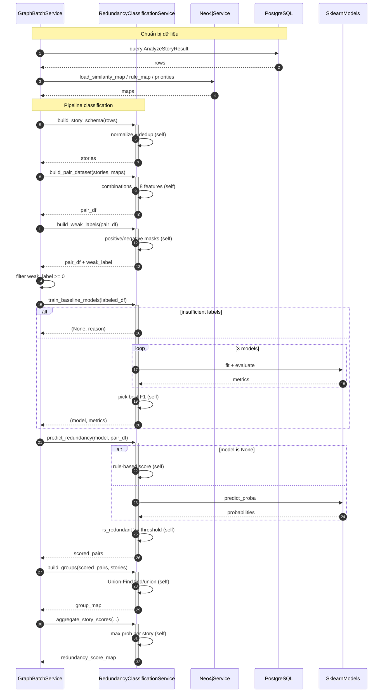

# Sequence Diagram — `RedundancyClassificationService`

**File:** `analyze_user_stories/src/services/redundancy_classification_service.py`  
**Caller:** `GraphBatchService.rebuild_workspace()` (sau khi graph Neo4j + priority đã được xây)  
**Chuẩn UML:** Phenikaa — lifeline, activation bar, sync / self / return / create / alt / loop

---

## 1. Bối cảnh (3 lớp)

| Lifeline | Lớp | Vai trò |
|----------|-----|---------|
| `GraphBatchService` | Business Logic | Điều phối batch, nạp map từ Neo4j |
| `RedundancyClassificationService` | Business Logic | Feature engineering + ML + gom nhóm |
| `Neo4jService` | Data Access | `load_similarity_map`, `load_rule_map`, `load_story_priorities` |
| `SklearnModels` | External | LR, RandomForest, HistGradientBoosting |
| `PostgreSQL` | Data Access | `AnalyzeStoryResult` rows (đầu vào `build_story_schema`) |

---

## 2. Mô tả luồng (7–10 dòng)

1. `GraphBatchService` truyền `rows` (PostgreSQL) vào `build_story_schema` → danh sách `StoryFeature` đã dedup.  
2. Nạp `similarity_map`, `rule_map`, `priority_map` từ Neo4j, gọi `build_pair_dataset` → DataFrame 8 đặc trưng cho mỗi cặp story.  
3. `build_weak_labels` gán nhãn yếu `1 / 0 / -1`; chỉ cặp có `weak_label ≥ 0` dùng để train.  
4. `train_baseline_models` so sánh 3 model sklearn, chọn best theo F1; nếu không đủ nhãn → `model = None`.  
5. `predict_redundancy` dự đoán xác suất; fallback rule-based khi không có model.  
6. `build_groups` dùng Union-Find trên cặp `is_redundant == True`.  
7. `aggregate_story_scores` lấy `max(redundancy_prob)` theo từng story.  
8. Kết quả trả về `GraphBatchService` để lọc top-K và ghi `REDUNDANT_WITH` lên Neo4j.

---

## 3. Sequence Diagram — Toàn cảnh (Orchestration)

```plantuml
@startuml RCS_Full_Orchestration
title RedundancyClassificationService — Luồng đầy đủ (từ GraphBatchService)

skinparam responseMessageBelowArrow true

participant ":GraphBatchService\n<<Business>>" as GBS
participant ":RedundancyClassificationService\n<<Business>>" as RCS
participant ":Neo4jService\n<<DAL>>" as Neo
database ":PostgreSQL" as PG
participant ":SklearnModels\n<<External>>" as ML

== Chuẩn bị dữ liệu (GraphBatchService) ==

GBS -> PG: query AnalyzeStoryResult\n(filter workspace_id)
activate PG
PG --> GBS: rows
deactivate PG

GBS -> Neo: load_similarity_map(workspace_id)
activate Neo
Neo --> GBS: similarity_rows
deactivate Neo

GBS -> Neo: load_rule_map(workspace_id)
activate Neo
Neo --> GBS: rule_rows
deactivate Neo

GBS -> Neo: load_story_priorities(workspace_id)
activate Neo
Neo --> GBS: priority_rows
deactivate Neo

GBS -> GBS: build similarity_map,\nrule_map, priority_map
note right of GBS
  **self:** sorted_term_pair()
  gộp max score / confidence / lift
end note

== Pipeline RedundancyClassificationService ==

GBS -> RCS: build_story_schema(rows)
activate RCS
RCS -> RCS: normalize canonical SVO
note right of RCS: **self:** strip + lower()\nskip thiếu subject/action/object
RCS -> RCS: dedup by story_id
RCS --> GBS: stories : List[StoryFeature]
deactivate RCS

GBS -> RCS: build_pair_dataset(\nstories, similarity_map,\nrule_map, priority_map)
activate RCS
RCS -> RCS: combinations(stories, 2)
note right of RCS
  **self:** 8 features / cặp
  same_subject, same_action, same_object
  action_similarity, object_similarity
  rule_confidence, rule_lift, priority_gap
end note
RCS --> GBS: pair_df : DataFrame
deactivate RCS

GBS -> RCS: build_weak_labels(pair_df)
activate RCS
RCS -> RCS: apply positive_mask
RCS -> RCS: apply negative_mask
note right of RCS
  **self:** weak_label = 1 | 0 | -1
  positive: sim cao + rule mạnh
  negative: sim thấp + rule yếu
end note
RCS --> GBS: pair_df (cột weak_label)
deactivate RCS

GBS -> GBS: labeled_df = pair_df[weak_label >= 0]
note right of GBS: **self:** lọc cặp có nhãn

GBS -> RCS: train_baseline_models(labeled_df)
activate RCS

alt pair_df.empty hoặc chỉ 1 class
    RCS --> GBS: (None, {reason})
else đủ nhãn 2 class
    RCS -> RCS: train_test_split(stratify=y)
    note right of RCS: **self:** test_size=0.3
    loop [3 models: LR, RF, HGB]
        RCS -> ML: fit(X_train, y_train)
        activate ML
        ML --> RCS: fitted_model
        deactivate ML
        RCS -> ML: predict(X_test)
        activate ML
        ML --> RCS: y_pred
        deactivate ML
        RCS -> ML: predict_proba / decision_function
        activate ML
        ML --> RCS: proba
        deactivate ML
        RCS -> RCS: tính F1, recall, PR-AUC
        note right of RCS: **self:** lưu scores[name]
    end
    RCS -> RCS: chọn best_model theo F1_redundant
    RCS --> GBS: (best_model, {best_model, metrics})
end
deactivate RCS

GBS -> RCS: predict_redundancy(model, pair_df)
activate RCS

alt pair_df.empty
    RCS --> GBS: pair_df (cột rỗng)
else model == None
    RCS -> RCS: weighted rule score
    note right of RCS
      **self:** 0.35·object_sim
      + 0.20·action_sim + ...
    end note
else model != None
    RCS -> ML: predict_proba(pair_df[features])[:, 1]
    activate ML
    ML --> RCS: redundancy_prob[]
    deactivate ML
end

RCS -> RCS: is_redundant = prob >= threshold
note right of RCS: **self:** threshold mặc định 0.6\n(REDUNDANCY_THRESHOLD)
RCS --> GBS: scored_pairs : DataFrame
deactivate RCS

GBS -> RCS: build_groups(scored_pairs, stories)
activate RCS
RCS -> RCS: khởi tạo parent map
loop [mỗi cặp is_redundant == True]
    RCS -> RCS: union(left_id, right_id)
    note right of RCS: **self:** find() + union()
end
RCS -> RCS: gán group_id theo root
RCS --> GBS: group_map : Dict[story_id, group_id]
deactivate RCS

GBS -> RCS: aggregate_story_scores(scored_pairs, stories)
activate RCS
RCS -> RCS: max(prob) theo từng story_id
note right of RCS: **self:** duyệt từng cặp trong pair_df
RCS --> GBS: redundancy_score_map
deactivate RCS

== Ghi kết quả (GraphBatchService — ngoài service) ==

GBS -> GBS: sort + filter top-K export_pairs
GBS -> Neo: save_redundancy_pairs / save_story_priority_v2
note over GBS, Neo: Không thuộc redundancy_classification_service.py

@enduml
```

---

## 4. Sequence Diagram — Nội bộ service (chi tiết method)

Chỉ các thao tác **bên trong** `RedundancyClassificationService` (self-message & gọi sklearn).

```plantuml
@startuml RCS_Internal_Methods
title RedundancyClassificationService — Góc nhìn nội bộ

participant ":RedundancyClassificationService" as RCS
participant ":SklearnModels" as ML
entity ":StoryFeature" as SF

== build_story_schema ==

RCS -> RCS: build_story_schema(rows)
activate RCS
loop [mỗi row trong rows]
    alt thiếu asr_user_story_id hoặc SVO
        RCS -> RCS: continue
    else hợp lệ
        RCS -> SF: <<create>> StoryFeature
        activate SF
        deactivate SF
    end
end
RCS -> RCS: dedup[story_id] = story
RCS --> RCS: return list(dedup.values())
deactivate RCS

== build_pair_dataset ==

RCS -> RCS: build_pair_dataset(...)
activate RCS
loop [combinations(stories, 2)]
    RCS -> RCS: sorted_term_pair(story_ids)
    RCS -> RCS: lookup similarity_map, rule_map
    RCS -> RCS: tính same_*, priority_gap
    RCS -> RCS: append row → rows[]
end
RCS --> RCS: return DataFrame(rows)
deactivate RCS

== build_weak_labels ==

RCS -> RCS: build_weak_labels(pair_df)
activate RCS
alt pair_df.empty
    RCS --> RCS: return (weak_label=[])
else
    RCS -> RCS: weak_label = -1
    RCS -> RCS: positive_mask → label 1
    RCS -> RCS: negative_mask → label 0
end
deactivate RCS

== train_baseline_models ==

RCS -> RCS: train_baseline_models(labeled_df)
activate RCS
RCS -> RCS: train_test_split + stratify
loop [logistic_regression, random_forest, hist_gradient_boosting]
    RCS -> ML: fit / predict / predict_proba
    ML --> RCS: metrics per model
end
RCS -> RCS: best_name = max(F1_redundant)
RCS --> RCS: return (fitted_models[best], metrics)
deactivate RCS

== predict_redundancy ==

RCS -> RCS: predict_redundancy(model, pair_df)
activate RCS
alt model is None
    RCS -> RCS: score = weighted sum(features)
    RCS -> RCS: clip(0, 1)
else
    RCS -> ML: predict_proba(feature_cols)[:, 1]
    ML --> RCS: redundancy_prob
end
RCS -> RCS: is_redundant = prob >= self.threshold
RCS --> RCS: return pair_df
deactivate RCS

== build_groups (Union-Find) ==

RCS -> RCS: build_groups(pair_df, stories)
activate RCS
RCS -> RCS: parent = {id: id}
loop [pair_df where is_redundant]
    RCS -> RCS: find(left) / find(right)
    RCS -> RCS: union(left, right)
end
loop [mỗi story]
    RCS -> RCS: root = find(story_id)
    RCS -> RCS: assign group_N
end
RCS --> RCS: return group_map
deactivate RCS

== aggregate_story_scores ==

RCS -> RCS: aggregate_story_scores(pair_df, stories)
activate RCS
loop [mỗi cặp trong pair_df]
    RCS -> RCS: score_map[id] = max(score, prob)
end
RCS --> RCS: return score_map
deactivate RCS

@enduml
```

---

## 5. Mermaid (xem trên GitHub)

---

## 6. Bảng method ↔ message

| # | Message (sync) | Loại UML | Return |
|---|----------------|----------|--------|
| 1 | `build_story_schema(rows)` | sync + **self** (normalize, dedup) | `List[StoryFeature]` |
| 2 | `build_pair_dataset(...)` | sync + **self** (combinations) | `DataFrame` |
| 3 | `build_weak_labels(pair_df)` | sync + **self** (masks) | `DataFrame` |
| 4 | `train_baseline_models(labeled_df)` | sync → ML; **self** (split, chọn best) | `(model, dict)` |
| 5 | `predict_redundancy(model, pair_df)` | sync → ML hoặc **self** (fallback) | `DataFrame` |
| 6 | `build_groups(...)` | sync + **self** (find/union) | `Dict[str,str]` |
| 7 | `aggregate_story_scores(...)` | sync + **self** (max loop) | `Dict[str,float]` |

**Không dùng trong service này:** async message, destroy message.  
**Create:** `StoryFeature` khi build schema; fitted sklearn model sau `fit`.

---

## 7. Tham chiếu mã

| Method | Dòng (approx.) |
|--------|----------------|
| `build_story_schema` | 31–58 |
| `build_pair_dataset` | 60–104 |
| `build_weak_labels` | 106–130 |
| `train_baseline_models` | 132–197 |
| `predict_redundancy` | 199–229 |
| `build_groups` | 231–260 |
| `aggregate_story_scores` | 262–274 |

**Caller:** `graph_batch_service.py` — `rebuild_workspace()` khoảng dòng 102–159.
